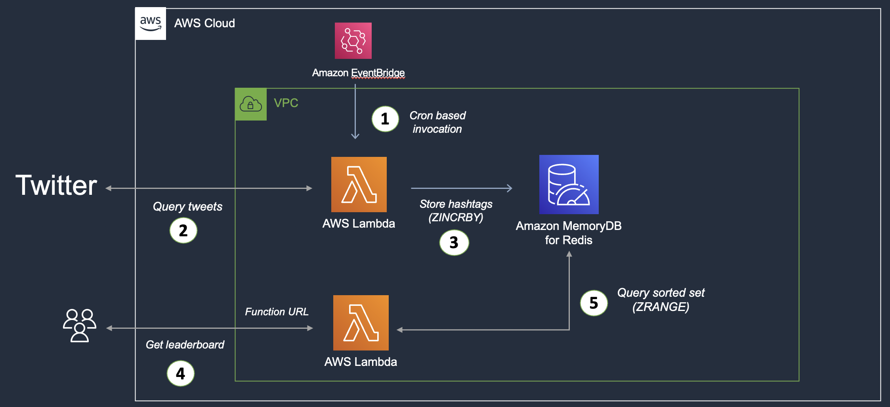

## Twitter Hashtag Leaderboard app

- The first part handles tweet ingestion: A Lambda function fetches tweets (from Twitter), extracts hashtags for each tweet, and stores them in MemoryDB (in a Redis Sorted Set). This function gets invoked based on a schedule based on a rule in CloudWatch trigger
- The second part provides the leaderboard functionality: This is yet another Lambda function that provides a HTTP(s) endpoint (thanks to Lambda Function URL) to query the sorted set and extract top 10 hashtags (leaderboard)

Details in the blog post - https://abhishek1987.medium.com/build-a-twitter-leaderboard-app-with-redis-and-aws-lambda-part-1-670e7a8c6a91